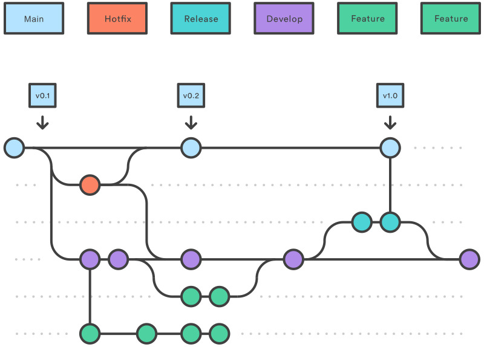

# Git Branching Naming Conventions
## [Git Branch Types][1]

* Regular branches.
* Temporary branches.

## Regular Git Branches
Regular branches in Git are long-lived branches that are a stable and structured way to organize ongoing work. Those branches are permanently available in the repository, and their naming is straightforward.

  #### Some regular Git branches are:

* **Master (master/main) branch.**

  The default production branch in a Git repository that needs to be permanently stable. Developers can merge changes into the master branch only after code review and testing. All collaborators on a project must keep the master branch stable and updated.

* **Development (dev) branch.** 

  The main development branch that serves as a central hub for developers to integrate new features, bug fixes, and other changes. Its primary purpose is to be the place for making changes to keep the developers from implementing them directly in the master branch. Developers test, review, and merge the changes from the dev into the master branch.

* **QA (QA/test) branch.**

  The branch that contains all the code ready for QA and automation testing. QA testing is necessary before implementing any change in the production environment to maintain a stable codebase.

## Temporary Git Branches
Temporary branches are short-lived and disposable. Those branches serve specific, short-term purposes and are often deleted afterward.

Some of the temporary branches in Git are:

  * **Bugfix branch.** 
  
    The bugfix branch contains the code with bugs that require prompt fixes. It can be the rejected code from feature branches that needs fixing before implementation.

  * **Hotfix branch.**
  
    The hotfix branch is a place for implementing a temporary solution into a buggy code without adhering to the usual procedure. The hotfix branch is used in an emergency and when a fast fix is needed. Developers merge the hotfix branch directly into the production branch and later into the development branch.

  * **Feature branch.** 

    A feature branch serves to add, reconfigure, or remove a feature. The feature branch is based on the development branch. After the changes are made, developers merge the feature branch back into the development branch.
    
  * **Experimental branch.** 
  
    This branch serves as a place for developing new features or ideas that are not part of a release or a sprint. It is a branch for trying out new things.

  * **WIP branch.** 
  
    Devs use WIP (work in progress) branches to develop or try out new features. These branches may not necessarily be part of the regular development workflow. WIP branches are project-specific and often informal, with no specific or standardized rules.

  * **Merging branch.**

    A merging branch is a temporary branch used for resolving merge conflicts. Conflicts can arise when merging the latest development and a feature or hotfix branch into another branch. The merging branch is also useful when combining two branches of a feature developed by multiple contributors. This process involves merging, verifying, and finalizing the changes.

## [A Simplified Convention for Naming Branches][2]

  
  git workflow(출처: https://andy-archive.tistory.com/38)

| 종류 | 설명 | 예 | 설명 |
| :---: | :--- | :---: | :--- |
| Main | 메인 브랜치 | main | (일반적으로 그대로 사용) |
| Hotfix | 디버깅 브랜치 | hotfix-1.1.4 | 1.1 버전 디버깅 |
| Release | 배포하기 위한 브랜치 | release-1.1 | 1.1 버전 |
| Develop | 배포 전 개발 브랜치 | develop | (일반적으로 그대로 사용) |
| Feature | 기능 개발 브랜치 | feature/signin | 로그인 기능 브랜치 |

[1]: https://phoenixnap.com/kb/git-branch-name-convention
[2]: https://minha0220.tistory.com/72